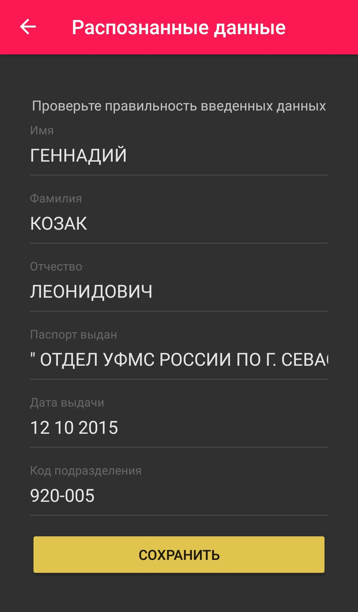

Karma Auth App 
===================
Karma Auth App is an android client for [karma auth service](https://github.com/Dimitreee/karmaAuth_theme6).

Screenshots
-----------
 

Stack
-----------
* [OkHttp](https://github.com/square/okhttp)
* [Gson](https://github.com/google/gson)
* [Kotlin Coroutines](https://github.com/Kotlin/kotlinx.coroutines)

How to build
-----------
1. ```git clone https://github.com/LexLeontiev/karmaauth.git```
2. [Download](https://developer.android.com/studio/) Android Studio, if you haven't it yet
2. Open project in Android Studio (Open an existing Android Studio project) 
3. Click "OK" to use Gradle Wrapper
4. Build project and run it on you device(or emulator)
5. ...or download apk from release version [attachments](https://github.com/LexLeontiev/karmaauth/releases) =)


